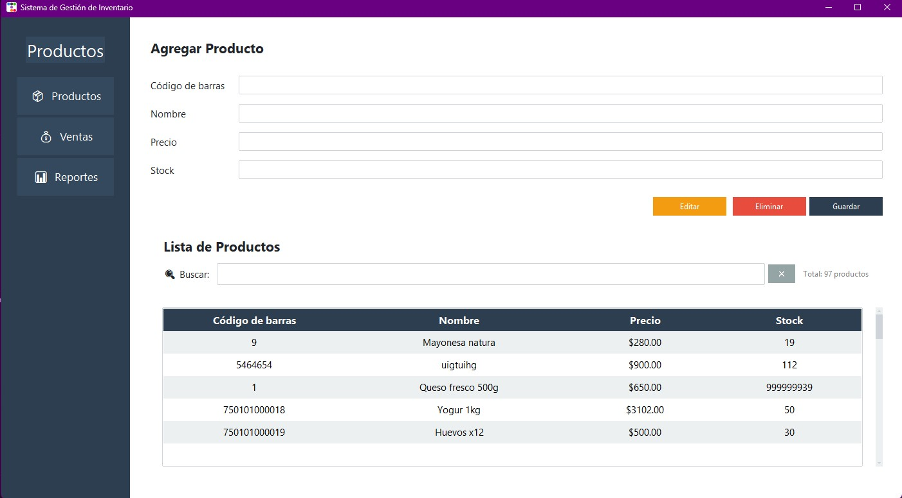
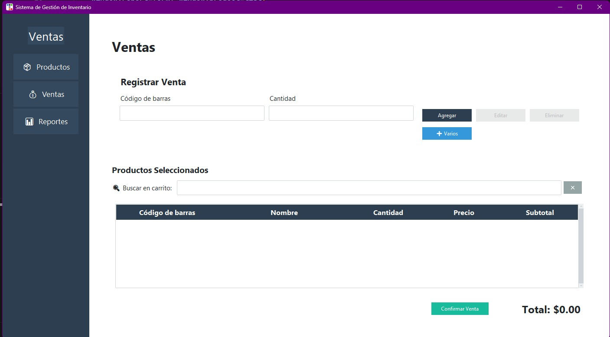
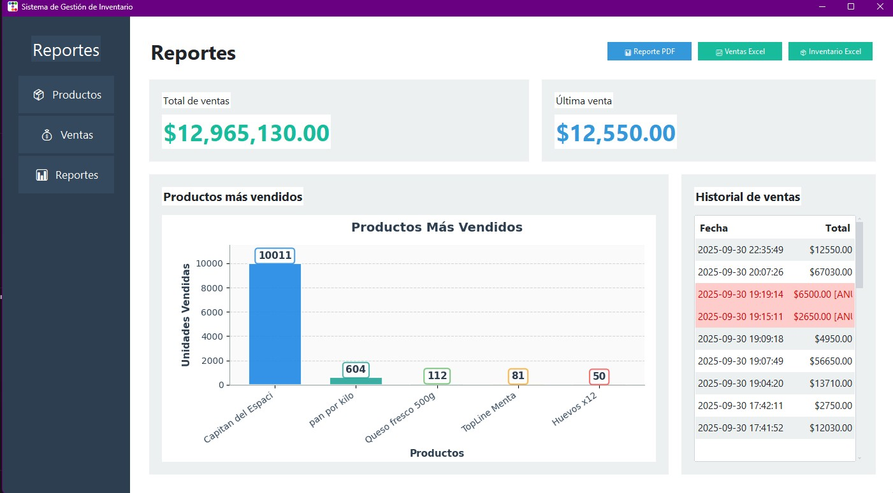

# 🏪 App-Stock | Sistema de Gestión de Inventario

> **Aplicación de escritorio completa desarrollada en Python** para la gestión integral de inventario, ventas y reportes empresariales.

[](https://python.org)
[](https://mysql.com)
[](https://pytest.org)
[](LICENSE)

---

## 🎯 **Descripción del Proyecto**

**App-Stock** es una solución empresarial completa que demuestra mis habilidades en desarrollo de software de escritorio, arquitectura de aplicaciones y gestión de bases de datos. El sistema permite a los negocios gestionar su inventario, procesar ventas y generar reportes profesionales de manera eficiente.

### **¿Por qué este proyecto?**

- ✅ **Arquitectura MVC** - Separación clara de responsabilidades
- ✅ **Base de datos relacional** - Diseño optimizado con MySQL
- ✅ **Interfaz moderna** - UI profesional con ttkbootstrap
- ✅ **Testing completo** - Suite de pruebas con pytest
- ✅ **Distribución** - Instalador automático para usuarios finales

---

## 🚀 **Demo y Instalación**

### **🎯 Para Usuarios Finales (Recomendado)**

**Descarga e instala en 3 pasos:**

1. **Descargar instalador** desde [Releases](https://github.com/EzequielPedulla/App-stock/releases)
2. **Ejecutar como administrador** el archivo `App-Stock-Installer-v1.0.exe`
3. **¡Listo!** La aplicación se abre automáticamente con base de datos configurada

> ⚡ **Instalación automática** - Incluye MySQL, dependencias y configuración completa

### **👨‍💻 Para Desarrolladores**

```bash
# Clonar repositorio
git clone https://github.com/EzequielPedulla/App-stock.git
cd App-stock

# Crear entorno virtual
python -m venv venv
source venv/bin/activate  # Windows: venv\Scripts\activate

# Instalar dependencias
pip install -r requirements.txt

# Configurar base de datos (opcional - usar SQLite para desarrollo)
# Crear archivo .env con configuración MySQL

# Ejecutar aplicación
python main.py
```

### **📋 Requisitos del Sistema**

- **Windows 10/11** (instalador) o **Python 3.11+** (desarrollo)
- **4 GB RAM** mínimo
- **500 MB** espacio en disco
- **MySQL 8.0+** (incluido en instalador)

---

## 🛠️ **Stack Tecnológico**

| **Categoría**     | **Tecnologías**                               |
| ----------------- | --------------------------------------------- |
| **Backend**       | Python 3.11+, PyMySQL, python-dotenv          |
| **Frontend**      | tkinter, ttkbootstrap (UI moderna)            |
| **Base de Datos** | MySQL 8.0+                                    |
| **Reportes**      | ReportLab (PDF), OpenPyXL (Excel), Matplotlib |
| **Testing**       | pytest, pytest-cov, pytest-mock               |
| **Distribución**  | PyInstaller, Inno Setup                       |

---

## 📋 **Funcionalidades Principales**

### **🛍️ Gestión de Inventario**

- CRUD completo de productos con código de barras
- Control automático de stock con alertas
- Búsqueda avanzada y filtros

### **💰 Sistema de Ventas**

- Carrito de compras intuitivo
- Cálculo automático de totales e impuestos
- Generación de tickets en PDF
- Artículos "Varios" para productos no registrados

### **📊 Reportes y Análisis**

- Reportes de inventario y ventas
- Exportación a PDF y Excel con gráficos
- Historial completo de transacciones
- Anulación de ventas con reintegro de stock

### **🎨 Interfaz de Usuario**

- Diseño moderno y responsivo
- Navegación intuitiva por pestañas
- Temas personalizables
- Experiencia de usuario optimizada

---

## 🏗️ **Arquitectura del Proyecto**

```
App-Stock/
├── app/
│   ├── controllers/     # Lógica de negocio (MVC)
│   │   ├── product_controller.py
│   │   ├── sale_controller.py
│   │   └── report_controller.py
│   ├── models/          # Modelos de datos
│   │   ├── database.py
│   │   └── product.py
│   ├── services/        # Servicios (exportación)
│   │   └── export_service.py
│   └── views/           # Interfaz gráfica
│       ├── main_window.py
│       ├── product_form.py
│       ├── sale_form.py
│       └── report_form.py
├── tests/               # Suite de pruebas
├── docs/                # Documentación
└── main.py              # Punto de entrada
```

### **Patrones de Diseño Implementados:**

- **MVC (Model-View-Controller)** - Separación clara de responsabilidades
- **Repository Pattern** - Abstracción de acceso a datos
- **Service Layer** - Lógica de negocio encapsulada
- **Factory Pattern** - Creación de objetos de exportación

---

## 🧪 **Testing y Calidad**

```bash
# Ejecutar toda la suite de tests
pytest

# Con cobertura de código
pytest --cov=app --cov-report=html

# Tests específicos
pytest tests/test_export_service.py -v
pytest tests/test_cancel_sale.py -v
```

**Cobertura de tests:** 20+ tests que cubren:

- ✅ Funcionalidades de exportación
- ✅ Cancelación de ventas
- ✅ Integración de componentes
- ✅ Controladores principales

---

## 📸 **Capturas de Pantalla**

### **Interfaz Principal**


_Vista principal del sistema con navegación lateral y gestión de productos_

### **Sistema de Ventas**


_Interfaz de ventas con carrito de compras y cálculo automático de totales_

### **Reportes y Exportación**


_Generación de reportes con gráficos y exportación a PDF/Excel_

---

## 🎯 **Habilidades Demostradas**

### **💻 Desarrollo Backend**

- **Python Avanzado** - POO, decoradores, context managers
- **Bases de Datos** - Diseño relacional, consultas optimizadas, transacciones
- **Arquitectura de Software** - Patrones MVC, Repository, Service Layer
- **APIs y Servicios** - Manejo de dependencias, configuración con .env

### **🎨 Desarrollo Frontend**

- **Interfaces Gráficas** - tkinter, ttkbootstrap, diseño responsivo
- **UX/UI Design** - Experiencia de usuario intuitiva y moderna
- **Integración Frontend-Backend** - Comunicación eficiente entre capas
- **Temas y Estilos** - Personalización visual y consistencia

### **🔧 DevOps y Calidad**

- **Testing Automatizado** - pytest, cobertura de código, mocks
- **Distribución** - PyInstaller, instaladores automáticos
- **Gestión de Dependencias** - requirements.txt, entornos virtuales
- **Documentación** - README profesional, docstrings, guías de instalación

### **📋 Gestión de Proyectos**

- **Control de Versiones** - Git, branching, commits descriptivos
- **Estructura de Proyecto** - Organización modular y escalable
- **Código Limpio** - PEP 8, type hints, documentación
- **Planificación** - Roadmap, features, mejoras futuras


## 📞 **Contacto**

**Ezequiel Pedulla** - Desarrollador Python

- 🌐 **GitHub:** [@EzequielPedulla](https://github.com/EzequielPedulla)
- 📧 **Email:** [ivanpedulla@gmail.com]
- 💼 **LinkedIn:** [https://www.linkedin.com/in/ezequiel-pedulla-72336b200/]

---

## 📄 **Licencia**

Este proyecto está bajo la Licencia MIT. Ver el archivo [LICENSE](LICENSE) para más detalles.
